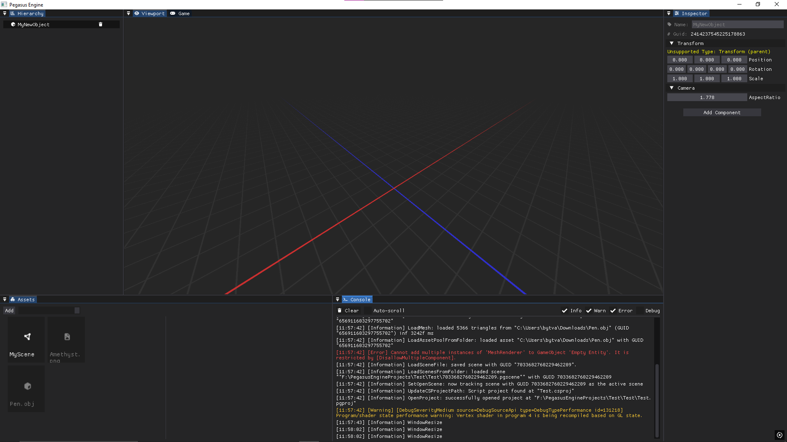

# Pegasus Engine


Pegasus Engine is a modular 3D game engine built with **C# 13** and **.NET 9.0**, utilizing **OpenGL** via **OpenTK**. It is designed with a layer-based architecture, efficient asset management, and integrated profiling tools.

Inspired by [Spartan Engine](https://github.com/PanosK92/SpartanEngine) and [Laura](https://github.com/jakubg05/Laura).

## Features

- **Modular Architecture**: Uses a `LayerStack` system to manage different engine components (Rendering, UI, Logic) independently.
- **Modern Rendering**: OpenGL-based renderer with support for shaders, skyboxes, and meshes.
- **Asset Pipeline**:
   - **Model Loading**: Integrated with **AssimpNet** for importing various 3D formats.
   - **Image Processing**: Fast texture loading via **StbImageSharp**.
   - **Metadata System**: YAML-based `.pgmeta` files for tracking asset GUIDs and properties.
- **Integrated Profiler**: Real-time performance monitoring with high-precision timers.
- **Event System**: Custom event-driven input and engine state management.
- **Logging**: Comprehensive diagnostic logging using **Serilog**.
- **Editor**: ImGui-based editor interface (Work in Progress).

## Tech Stack

- **Language**: C# 13.0
- **Framework**: .NET 9.0
- **Graphics API**: OpenGL 4.x
- **Libraries**:
  - [OpenTK 4](https://opentk.net/): Graphics, windowing, and input.
  - [ImGui.NET](https://github.com/ImGuiNET/ImGui.NET): Editor UI.
  - [AssimpNet](https://github.com/lucasg/assimpnet): 3D model importing.
  - [YamlDotNet](https://github.com/aaubry/YamlDotNet): Asset metadata serialization.
  - [Serilog](https://serilog.net/): Structured logging.
  - [StbImageSharp](https://github.com/Starnick/StbImageSharp): Lightweight image loading.

## Project Structure

```text
PegasusEngine/
├── Pegasus/               # Core engine source (Layers, Events, Renderer)
|   ├── res/               # Engine resources (Images, models)
|   └── src/               # Engine main code
|       ├── Core/          # Core components
|       ├── Project/       # Project managing
|       └── Renderer/      # 3D Rendering
├── PegasusEditor/         # Editor tools and UI
├── PegasusRuntime/        # Runtime components
└── old/                   # Legacy modules (Audio, Physics, Scripting) **IN REWORK**
```

## Supported Platforms
In projects current state, the only supported platform is Windows. There are plants to make it possible to work with Linux. MacOS might be supported in future but a this moment, there are no plants for it.

## Getting Started

### Prerequisites

- [.NET 9.0 SDK](https://dotnet.microsoft.com/download)
- A GPU supporting OpenGL 4.0+.

### Building

> [!WARNING]
> If you don't want to modify the code that any of the engine uses, download the official release on this github repo!

1. Clone the repository:
   ```bash
   git clone https://github.com/yourusername/PegasusEngine.git
   cd PegasusEngine
   ```

2. Build the project:
   ```bash
   dotnet build
   ```

3. Run the engine:
   ```bash
   dotnet run --project PegasusEngine/PegasusEngine.csproj
   ```

## Roadmap
- [X] **Core Scripting**: C# Assembly loading and building.
- [X] **Project Managment**: `.pgproj` serialization and asset tracking.
- [ ] **Prefab System**: Entity serialization and instantiation.
- [ ] **Particle System**: GPU-driven particle system.
- [ ] **PBR Rendering**: Implementation of a physicall-based shading model.
- [ ] **Audio Engine**: Implement a custom audio Engine
- [ ] **Physics System**: Custom 3D phsics
- [ ] **Linux Support**: Planned support for Linux platforms.

> [!TIP]
> There are many more features that might be beneficial for this project. Feel free to implement them or create a new *Issue* requestion it, but don't forget to specify what it should contain.

## Projects Using Pegasus
| Project | Description | Autor |
|---------|-------------|-------|
|         |             |       |
|---------|-------------|-------|

There are currently no projects :(

**Using Pegasus Engine in any way, shape or form? Reach out to me, I'd love to showcase your project!

## License

This project is licensed under the MIT License - see the [LICENSE](LICENSE) file for details.

